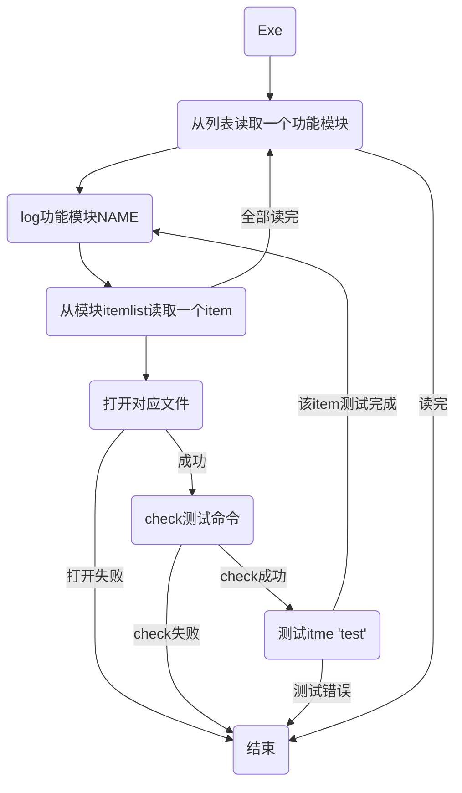

```mermaid

graph TD


e(Exe) -->r(从列表读取一个功能模块)
r-->rname(log功能模块NAME)
rname-->ritem(从模块itemlist读取一个item)
ritem--全部读完-->r
ritem-->op( 打开对应文件)
op--打开失败-->end1
op--成功-->check(check测试命令)
check--check失败-->end1
check--check成功-->test(测试itme 'test')
test--测试错误-->end1
test--该item测试完成-->rname
r--读完-->end1(结束)

```
