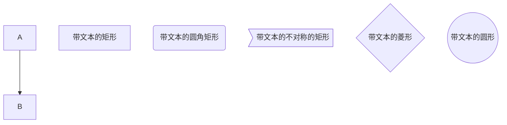

$$$f(x_1,x_2,\dots,x_n) = x_1^2 + x_2^2 + \cdots + x_n^2$$$
$$$
f(x1,x2,…,xn)=x21+x22+⋯+x2n

{ \sum_{i=0}^n i^2= \frac {(n^2+n)(2n+1)}{6}} \tag{1.1}
$$$

```mermaid
graph TD
   A --> B

    id[带文本的矩形]
    id4(带文本的圆角矩形)
    id3>带文本的不对称的矩形]
    id1{带文本的菱形}
    id2((带文本的圆形))
```