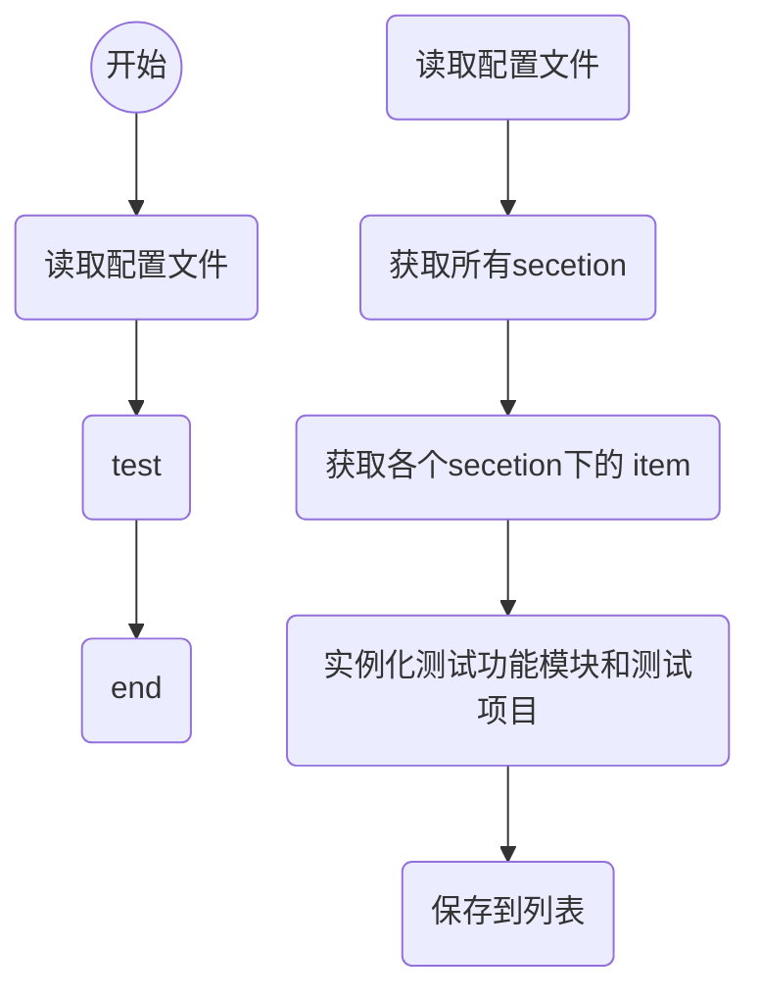

```mermaid

graph TD
start((开始)) --> read(读取配置文件)
read --> exe(test)
exe --> en(end)


i1(读取配置文件) --> i2(获取所有secetion)
i2 --> i3(获取各个secetion下的 item)
i3 --> i4(实例化测试功能模块和测试项目)
i4 --> i5(保存到列表)


```