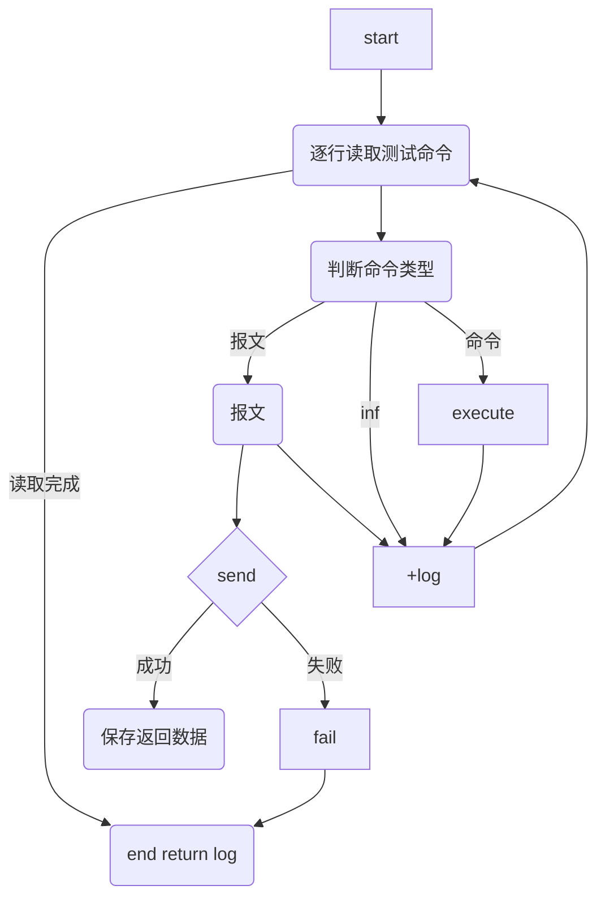

```mermaid
graph TD
start --> read(逐行读取测试命令)
read--读取完成-->end1
read --> judge(判断命令类型)
judge--报文-->msg(报文)
msg-->send{send}
msg-->+log
judge--info-->+log
judge--命令-->execute
execute-->+log
+log-->read
send--成功-->success(保存返回数据)
send--失败-->fail
fail --> end1(end return log)

```
